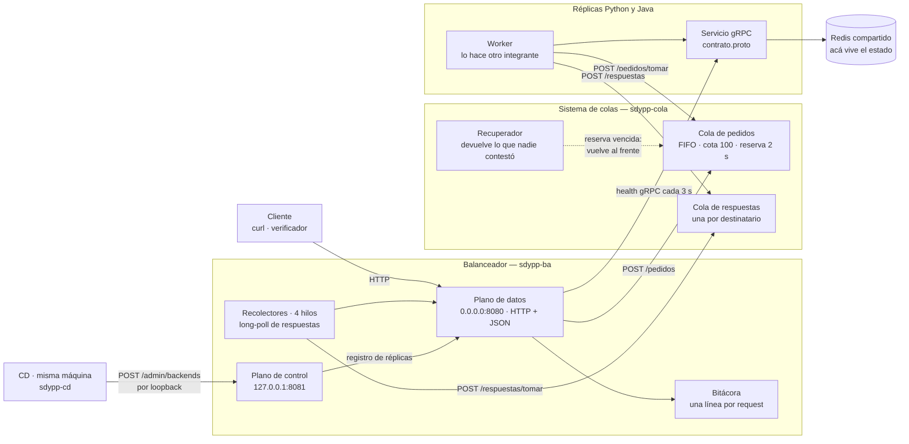
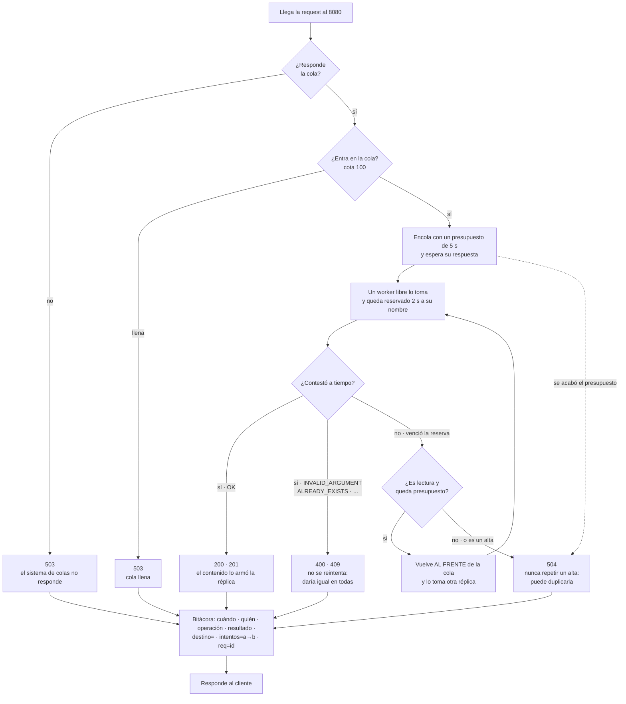

# Balanceador — SDyPP Clase 2

La única URL pública del servicio. Recibe el contrato del enunciado (`GET /`,
`GET /health`, `POST /echo`, `GET /personas`, `POST /personas`), **publica cada pedido en
el sistema de colas** y espera su respuesta para contestarle al cliente.

Desde este refactor el balanceador **no le habla a ninguna réplica** por el plano de datos.
Los workers viven adentro de las réplicas y van a buscar trabajo a la cola. Nadie elige:
la réplica que tenga un worker libre toma el próximo pedido.

Traduce en vez de reenviar bytes porque el enunciado pide **una línea de bitácora por
request**, y para escribirla hay que entender el pedido. Un proxy TCP no sabría qué operación
pasó.

> **Qué cambió respecto de la rama anterior.** La cola era un `deque` adentro del proceso y
> los workers eran hilos suyos. Ahora la cola es **otro contenedor** (`cola/`) con **dos colas**
> —pedidos y respuestas— y los workers son de las réplicas, que los implementa otro integrante.
> Lo que se ganó, lo que se perdió y lo que queda abierto está en
> [Por qué la cola vive afuera](#por-qué-la-cola-vive-afuera) y en [Estado](#estado).

### El mapa



Las dos flechas que salen del balanceador hacia las réplicas son **sólo el health check**.
El tráfico del servicio no pasa por ahí: entra y sale por la cola.

### Qué hace con cada request



La reasignación no la pide nadie: **la cola la hace sola** cuando vence la reserva. Es el
cambio más importante del refactor — con los workers adentro del balanceador, el que se comía
el error del RPC devolvía el pedido; ahora el worker está en la réplica y **una réplica que se
murió no avisa nada**. La única que puede notarlo es la cola.

## El contrato con el cliente

No cambió. **Toda** respuesta del puerto público tiene la misma forma, salga bien o mal:

```json
{"Code": 200, "contenido": {"app": "python", "version": 3, "host": "tomas-blue"}}
{"Code": 404, "contenido": {"error": "no existe"}}
```

`Code` repite el código HTTP y `contenido` es **siempre** un objeto: el payload si salió
bien, `{"error": "..."}` si no. Lo pone `Manejador.responder`, no cada handler: es la única
forma de garantizar que no se escape ninguna respuesta por un camino de error que nadie probó.

**El payload lo arma la réplica, no el balanceador.** Antes el balanceador traducía el mensaje
protobuf a JSON campo por campo; ahora el worker manda el `contenido` ya armado y el
balanceador sólo lo mete en el sobre. Agregar un campo a la app dejó de obligar a tocar acá.
La forma de cada `contenido` está en [`cola/README.md`](cola/README.md#las-operaciones).

## Levantarlo

**Son dos contenedores y la cola va primero.** Al revés, el balanceador arranca contestando
503 a todo y quien mire `/health` en esos segundos cree que está roto.

```bash
python3 consola.py
```

La primera vez pregunta lo que hace falta, **genera el token de la cola**, guarda
`balanceador.env` —que es el `--env-file` de los dos contenedores— y los levanta. Después es
el menú:

```
  Balanceador · casa-tomas · público :8080 · control 127.0.0.1:8081 · cola :8085
  3/3 sanas · cola sana · 0/100 en cola · 2 en vuelo

  1  Réplicas                 cuáles hay, sanas, consumiendo, en vuelo y atendidas
  2  Health público           lo que ve el verificador, con el estado de la cola
  3  Tráfico de prueba        correr el verificador contra este balanceador
  4  Agregar / quitar réplica  a mano, para una emergencia
  5  Bitácora                 últimas 25 líneas
  6  Contenedores             balanceador y cola: levantar, bajar, logs
  7  Configuración            ver y editar
  8  Consola del CD           el otro componente de Plataforma
  0  Salir
```

Un solo archivo de configuración para los dos contenedores a propósito: cada uno ignora las
variables del otro, y así los tres valores que tienen que coincidir —la URL, el token y el
puerto de la cola— se escriben una sola vez. El token de la opción 7 es el que hay que darle
a quien configure los workers de las réplicas.

**El registro de réplicas arranca vacío a propósito.** `BA_BACKENDS` queda sin usar: lo llena
el CD en el primer deploy. Precargarlo haría que el balanceador afirme tener réplicas que
quizá ya no existen.

### A mano, si preferís

```bash
docker build -t sdypp-cola:local cola/
docker run -d --name sdypp-cola --restart unless-stopped --network host \
    --env-file balanceador.env -v "$PWD/logs:/app/logs" sdypp-cola:local

docker build -t sdypp-balanceador:local .
docker run -d --name sdypp-ba --restart unless-stopped --network host \
    --env-file balanceador.env -v "$PWD/logs:/app/logs" sdypp-balanceador:local

curl -s localhost:8080/health | python3 -m json.tool
```

`--network host` en los dos: así el balanceador alcanza la cola por `127.0.0.1` sin salir a
la red, las réplicas de las otras casas la alcanzan por la IP de Tailscale de esta máquina, y
el CD llega al plano de control por `127.0.0.1:8081`.

Sin Docker: `python3 -m venv .venv`, `./.venv/bin/pip install -r requirements.txt`, y en dos
terminales `./.venv/bin/python cola/servidor.py` y `./.venv/bin/python app/balanceador.py`.
La cola **no necesita el venv**: es sólo biblioteca estándar.

## Pruebas

```bash
./.venv/bin/python -m unittest discover -s tests -v
```

Sólo `unittest`. `test_colas.py` y `test_servidor_cola.py` no necesitan `grpcio` (la cola no
depende de nada); `test_derivar.py` y `test_admin.py` importan el balanceador, que sí lo usa
para el health check.

- **`test_colas.py`** — las dos colas sin HTTP: FIFO, cota, devolución al frente, la reserva
  que vence y **cada fila de la regla de reintento**, el vencimiento del presupuesto, la
  segunda respuesta de un pedido atendido dos veces, y que cada destinatario se lleve sólo lo
  suyo.
- **`test_servidor_cola.py`** — el contrato HTTP con un servidor de verdad, hablado con el
  cliente real del balanceador: el ciclo completo publicar → tomar → responder → recolectar,
  el long-poll, el token, y que un `403` no envenene la conexión keep-alive.
- **`test_derivar.py`** — qué hace el balanceador con lo que la cola le contesta: traducción
  de códigos, `intentos=a→b`, **la cola caída como 503 inmediato**, y que `ESPERAS` no pierda
  memoria por ningún camino de error.
- **`test_admin.py`** — el POST incremental del CD: un deploy de Python no toca las Java.
- **`test_sobre.py`** — el sobre del contrato, para los ocho códigos que el balanceador puede
  devolver.
- **`test_consola.py`** — que los dos contenedores compartan el `--env-file`, y que el plano
  de control no quede expuesto sin querer.

Lo que **todavía no está probado punta a punta** es el sistema completo: hace falta el worker
de las réplicas, que lo está haciendo otro integrante.

## Verificador

Lo corre **otro equipo, desde otra casa**. Sólo biblioteca estándar: no hace falta instalar
nada nuestro para probarnos. No cambió.

```bash
python3 app/verificador.py http://100.101.15.93:8080 --n 100 --hilos 8 --alta
```

## Qué significa `/health` ahora

Contesta una sola pregunta: **¿el servicio puede atender ahora mismo?** Son `200` cuando la
cola está viva **y** hay al menos una réplica consumiendo de ella.

Lo que cambió es de dónde sale ese número. Antes era "cuántas réplicas pasan el health gRPC",
porque el balanceador les mandaba el tráfico él mismo y sólo se lo mandaba a ésas. Ahora una
réplica atiende porque **consume**, y eso lo sabe la cola, no el registro. Los dos números
pueden estar cruzados y los dos casos son reales:

| | Qué pasa | `/health` |
| :--- | :--- | :--- |
| Consume y no está registrada | arrancó antes de que el CD la conmute | `200` — está atendiendo |
| Registrada y sana, no consume | el contenedor vive y su worker no arrancó | `503` si es la única |
| Cola caída | nadie atiende nada | `503` siempre |

`replicasSanas` sigue saliendo, pero como información y no como veredicto: es lo que el CD
mira después de un deploy. El campo nuevo es `replicasConsumiendo`, y es el que decide.

La consola lo muestra como dos columnas separadas (`sano` y `consume`) justamente para que se
vea cuándo no coinciden.

## Los dos planos

| | Puerto | Escucha en | Qué sirve |
| :--- | :--- | :--- | :--- |
| **Datos** | `8080` | `0.0.0.0` | El contrato público. En `/admin` devuelve **404** |
| **Control** | `8081` | `127.0.0.1` | Sólo `/admin/backends` |

`/admin/backends` no vive en el puerto público sino en un socket propio que escucha
únicamente en loopback: **lo que no escucha en la red no se puede atacar desde la red.** El
único que conmuta es el CD, y corre en esta misma máquina.

```
POST /admin/backends   {"agregar": [{"destino": "casa:8091", "app": "python"}],
                        "quitar":  [{"destino": "casa:8090", "app": "python"}]}
```

**Es un delta, no un reemplazo.** Un destino que no aparece en el JSON queda exactamente
donde estaba. De eso depende que un deploy de Python no toque las réplicas Java, y al revés.

⚠️ **Lo que este POST ya no hace.** Antes agregar una réplica le arrancaba workers y quitarla
le cortaba el tráfico: el pool era el interruptor. Ahora es el **registro**. Una réplica
atiende porque su worker consume de la cola, no porque figure acá, y quitarla del registro
**no la saca de circulación**: eso lo hace el agente al bajar el contenedor blue. Conmutar
sigue siendo necesario para que `/health` cuente lo que hay y para que el CD sepa qué
encontró — pero el deploy tiene que apagar el blue igual que antes. **Es lo primero a revisar
con quien mantiene el CD.**

La respuesta perdió el campo `worker` (era el estado de un hilo nuestro, y ya no existe) y
ganó `consumiendo` y `ultimoPedidoHaceMs`, que salen de la cola.

## Por qué la cola vive afuera

La rama anterior argumentaba lo contrario, y vale la pena dejar los dos lados escritos porque
es exactamente el tipo de decisión que hay que poder defender en vivo.

**Lo que se gana**

1. **Agregar una réplica deja de ser reconfigurar el balanceador.** Antes había que
   anunciarla por `/admin/backends` para que naciera su worker. Ahora una réplica que arranca
   y consume ya está atendiendo; el registro es para saber qué hay, no para habilitar.
2. **El balanceador deja de saber cómo se le habla a una réplica.** El pedido es datos
   (JSON), no un `callable`: puede atenderlo un worker Java sin que acá cambie una línea.
3. **La concurrencia por réplica la decide la réplica.** `BA_WORKERS_POR_REPLICA` era el
   balanceador decidiendo cuánto aguanta una máquina que no conoce.

**Lo que se pierde, y hay que decirlo**

1. **Un salto de red más por pedido**, y un componente nuevo en el camino crítico.
2. **Un punto único de falla nuevo:** sin cola no se atiende nada, aunque las cuatro réplicas
   estén perfectas. Por eso `/health` contesta `503` con la cola caída aunque `replicasSanas`
   sea 4 — mentir ahí sería peor.
3. **La reasignación pasó a depender de un vencimiento**, no de un error. Antes el
   `UNAVAILABLE` del RPC era instantáneo; ahora hay que esperar `COLA_RESERVA` (2 s) para
   notar que una réplica se murió con el pedido en la mano. El presupuesto de 5 s deja lugar
   para un reintento, pero es más lento que antes y se nota en el p99.
4. **Un síntoma nuevo que antes no se podía ni representar:** una réplica sana que no
   consume. El contenedor vive y contesta el health gRPC, pero su worker no arrancó o no
   alcanza la cola. Sale en `/health` como `"consumiendo": false` y en la consola como una
   fila con `sano=sí · consume=no`.
5. **La Etapa 3 se complica.** Dos balanceadores contra una cola compartida vuelven a tener
   un punto único de falla. La cola ya está preparada para dos —las respuestas se guardan por
   destinatario y ninguno se lleva las del otro—, pero **la decisión de si van dos colas o una
   está abierta.**

**Lo que no cambió:** el contrato con el cliente es sincrónico. El cliente hace
`POST /personas` y espera su `201` en el mismo socket. Nada de tickets, `202` ni polling.

## Reglas

**Un presupuesto por pedido, espera incluida.** `BA_PRESUPUESTO=5` son cinco segundos desde
que el pedido entra a la cola hasta que el cliente tiene respuesta. Un pedido que esperó 4 s
tiene 1 s para que lo atiendan. Lo que le importa al cliente es cuánto tarda la respuesta, no
en qué parte del camino se fue el tiempo.

**El presupuesto viaja como `quedaMs`, no como un instante.** Los relojes de cuatro casas no
están sincronizados: si el pedido llevara un `vence_en` absoluto, una máquina adelantada dos
segundos descartaría pedidos vivos. El único reloj que cuenta es el de la cola.

**Cota de 100.** Pasado eso, `503` en el acto. Sin cota, con todas las réplicas caídas los
pedidos se acumulan sin límite hasta vencer; cada uno es un hilo del servidor y un cliente
colgado.

**La regla de reintento.** Es contrato, no detalle de implementación. Ahora la aplica la cola:

| Qué pasó | Lecturas (`GET /`, `POST /echo`, `GET /personas`) | Escritura (`POST /personas`) |
| :--- | :--- | :--- |
| La réplica tomó el pedido y no contestó en `COLA_RESERVA` | vuelve al frente si queda presupuesto | **`504`. Nunca reintentar.** |
| Se agotó el presupuesto | `504` | `504` |
| La réplica contestó `INVALID_ARGUMENT`, `ALREADY_EXISTS`, … | ese código | ese código |

"No contestó" no dice si alcanzó a ejecutarse: repetir un alta puede crear la persona dos
veces. Preferimos un `504` honesto a un duplicado silencioso. El default de `idempotente` en
la cola es `false` justamente por eso — ante la duda, no se reintenta.

**Gana la primera respuesta.** Si una réplica lenta contesta después de que la reserva venció
y otra ya resolvió el pedido, la segunda respuesta se descarta con un `409`. El cliente se
lleva la primera que llegó.

**No se persiste.** Las dos colas viven en memoria. En un contrato sincrónico, cuando se
volvería a replicar el pedido el cliente ya se fue. Reiniciar el contenedor de la cola tira
lo que estaba esperando, y la consola avisa antes de hacerlo.

## Decisiones

**Consumidores que compiten, sin round-robin.** Nadie reparte: el worker libre toma el
próximo pedido. Una réplica lenta toma menos; una caída no toma nada. El reparto sale solo de
la velocidad de cada una, sin contador compartido.

**Long-poll y no sondeo.** `tomar` se cuelga hasta 30 s esperando que aparezca algo. Sondear
sería o latencia (si se pregunta poco) o tráfico al pedo (si se pregunta mucho); colgarse es
las dos cosas bien y cuesta un hilo, que es lo que sobra.

**`tomar` es POST y no GET.** Saca el elemento de la cola: cambia el estado del servidor. Un
GET que muta es lo que cualquier reintento automático de un cliente HTTP convierte en pedidos
perdidos.

**Cuatro recolectores.** Cada uno mantiene un long-poll abierto contra la cola de respuestas.
Con uno solo, todas las respuestas del servicio pasarían por un único round-trip serializado
y ése sería el techo de throughput.

**El destinatario lo pone la cola, no el worker.** El worker manda `id`, `estado` y
`contenido`; a quién va dirigida la respuesta lo sabe la cola porque lo guardó del pedido. Si
se lo preguntáramos al worker podría contestar apuntando a otro balanceador.

**Salud sólo preguntando.** Un hilo consulta `grpc.health.v1.Health` cada 3 s. Antes había
dos fuentes —el chequeo y el fallo de un RPC real— y alimentaban el mismo contador. Ahora el
balanceador no hace RPCs de negocio, así que **éste es el único aviso que hay de este lado**.
La caída igual la nota la cola, por la reserva, pero para otra cosa.

**Un canal gRPC por réplica, reusado.** Abrir uno por chequeo tiraría el handshake a la
basura cada tres segundos.

**Conexiones reusadas contra la cola.** `http.client` y no `urllib.request`: hay una request
por cada request del usuario más un long-poll permanente por recolector, y pagar un handshake
TCP cada vez le agregaría un round-trip a algo que ya cruza la red de más que antes.

## Traducción de errores

| Estado que manda el worker | HTTP |
| :--- | :--- |
| `OK` | `200` · `201` en alta |
| `INVALID_ARGUMENT` | `400` |
| `NOT_FOUND` | `404` |
| `ALREADY_EXISTS` | `409` |
| `DEADLINE_EXCEEDED` | `504` |
| `UNAVAILABLE` | `503` |
| — | `503` cola llena · `503` cola caída · `502` la cola rechazó el pedido |

Son los nombres de los códigos de estado de gRPC, a propósito: el worker ya envuelve el
servicio gRPC de su réplica y sólo tiene que nombrar el código que recibió. El código va dos
veces, en la línea de estado HTTP y en el `Code` del sobre, y son siempre el mismo valor.

## Bitácora

Mismo formato en los tres componentes —balanceador, cola y réplica—, a propósito: es lo que
permite tomar un alta del verificador y seguirla por tres archivos con el mismo `req=`.

```
2026-09-18T19:02:11-03:00 | cola@casa-tomas        | POST /pedidos       | 202 | req=4b7baf0d… POST /personas para=balanceador@casa-tomas
2026-09-18T19:02:11-03:00 | cola@casa-tomas        | POST /pedidos/tomar | 200 | req=4b7baf0d… POST /personas tomado=100.91.134.43:8080 intento=1
2026-09-18T19:02:11-03:00 | balanceador@casa-tomas | POST /personas      | 201 | destino=100.91.134.43:8080 id=7 espera=6ms req=4b7baf0d…
```

`intentos=a→b` aparece sólo cuando hubo reasignación: es la evidencia de que la réplica `a`
se murió con el pedido y `b` atendió el mismo. `espera=` es cuánto estuvo el pedido en la
cola, que es el número que dice si hace falta agregar réplicas.

## Variables

Del balanceador:

| | Default | |
| :--- | :--- | :--- |
| `BA_PUERTO` | `8080` | Puerto público |
| `BA_PUERTO_ADMIN` | `8081` | Plano de control |
| `BA_ADMIN_BIND` | `127.0.0.1` | Dónde escucha el control. Sólo se cambia en la Etapa 3 |
| `BA_ADMIN_IPS` | *(vacío)* | Whitelist; vacío = sólo loopback |
| `BA_CASA` | `casa-tomas` | Sale en la bitácora |
| `BA_COLA_URL` | `http://127.0.0.1:8085` | Dónde vive el sistema de colas |
| `BA_COLA_TOKEN` | *(vacío)* | Tiene que ser el mismo `COLA_TOKEN` |
| `BA_IDENTIDAD` | `<nombre>@<casa>` | Con qué nombre recolecta sus respuestas |
| `BA_RECOLECTORES` | `4` | Hilos con un long-poll abierto contra la cola |
| `BA_ESPERA_RECOLECTOR` | `20` | Segundos de cada long-poll |
| `BA_PRESUPUESTO` | `5` | Presupuesto total por pedido, espera en cola incluida |
| `BA_GRACIA_COLA` | `1` | Margen sobre el presupuesto antes de rendirse solo |
| `BA_BACKENDS` | *(vacío)* | Réplicas iniciales. `host:puerto` o `host:puerto=java` |
| `BA_UMBRAL_CONSUMO` | `45` | Hace cuánto tiene que haber pedido trabajo una réplica para contarla como consumiendo. Mayor que el long-poll de los workers |
| `BA_INTERVALO_SALUD` | `3` | Segundos entre chequeos de salud |
| `BA_FALLOS_PARA_SACAR` | `2` | Chequeos malos seguidos que la marcan caída |
| `BA_EXITOS_PARA_VOLVER` | `1` | Chequeos buenos seguidos que la devuelven |
| `BA_TIMEOUT_SALUD` | `2` | Segundos por chequeo |

Las de la cola (`COLA_*`) están en [`cola/README.md`](cola/README.md#variables).

`BA_TIMEOUT_RPC` sigue funcionando como sinónimo de `BA_PRESUPUESTO` para no romper un
`.env` viejo, pero ya no hay ningún RPC que timeoutear: el nombre nuevo es el que describe lo
que hace.

## Estado

| | |
| :--- | :--- |
| ✅ | Dos colas en un proceso aparte: pedidos y respuestas |
| ✅ | Reasignación por reserva vencida, sin que la réplica muerta avise nada |
| ✅ | Un alta nunca se repite: `idempotente=false` y el default seguro en la cola |
| ✅ | Token compartido: sin él no se puede ni publicar ni tomar pedidos |
| ✅ | Health check continuo + registro de réplicas + conmutación desde el CD |
| ✅ | Bitácora cruzable entre los tres componentes: `req=`, `intentos=`, `espera=` |
| ✅ | Tests: las dos colas, el HTTP de la cola, `derivar`, el plano de control, el sobre |
| ⬜ | **El worker de las réplicas** — lo hace otro integrante; contrato en `cola/README.md` |
| ⬜ | Prueba punta a punta con réplicas de verdad (falta el worker) |
| ⬜ | Revisar con el CD qué significa conmutar ahora que el registro no rutea |
| ⬜ | Un token para el balanceador y otro para los workers: publicar y consumir no son el mismo permiso |
| ⬜ | Etapa 3: ¿dos colas independientes o una compartida? |
