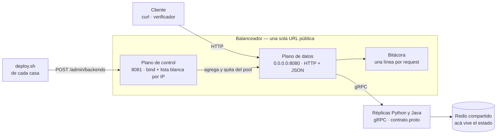
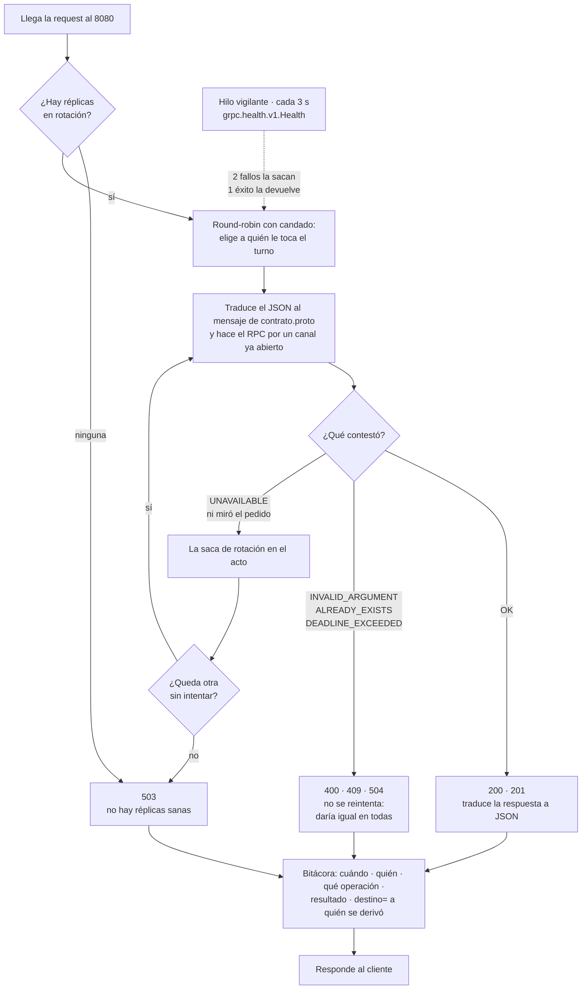

# Balanceador — SDyPP Clase 2

La única URL pública del servicio. **Habla HTTP hacia afuera y gRPC hacia adentro:**
recibe el contrato del enunciado (`GET /`, `GET /health`, `POST /echo`,
`GET /personas`, `POST /personas`), elige una réplica del pool y le hace el RPC de
`contrato.proto` que corresponda.

Traduce en vez de reenviar bytes porque el enunciado pide **una línea de bitácora
por request diciendo a quién se la derivó**, y para escribir esa línea hay que
entender el pedido. Un proxy TCP no sabría qué operación pasó.

### El mapa



Las réplicas no están hardcodeadas: cada casa se anuncia sola por el plano de
control cuando corre su `deploy.sh`. El plano de datos nunca conoce `/admin`, y el
de control nunca ve tráfico del servicio.

### Qué hace con cada request



El reintento y el `destino=` de la bitácora son los dos agregados propios: el
enunciado pide elegir, reenviar y responder, y esto además tapa la muerte de una
réplica y deja la operación auditable.

## Levantarlo

```bash
docker build -t sdypp-balanceador:local .

docker run -d --name sdypp-ba --restart unless-stopped --network host \
    -e BA_CASA=casa-tomas \
    -e BA_BACKENDS=100.91.134.43:8080,100.78.246.64:8080 \
    -e BA_ADMIN_BIND=0.0.0.0 \
    -e BA_ADMIN_IPS=127.0.0.1,100.101.15.93,100.78.246.64,100.120.186.92,100.91.134.43 \
    -v "$PWD/logs:/app/logs" \
    sdypp-balanceador:local

curl -s localhost:8080/health | python3 -m json.tool
```

`--network host` no es capricho: el plano de control tiene que atarse a una
dirección del tailnet para que las casas conmuten, y `BA_ADMIN_IPS` lleva las IPs
de las que pueden hacerlo. Sin esas dos variables el balanceador arranca igual,
pero el `deploy.sh` de cada casa recibe **403** al avisar.

Sin Docker: `python3 -m venv .venv`, `./.venv/bin/pip install -r requirements.txt
-r requirements-build.txt`, generar los stubs con `./.venv/bin/python -m
grpc_tools.protoc -I. --python_out=app --grpc_python_out=app contrato.proto` y
`./.venv/bin/python app/balanceador.py`.

## Verificador

Lo corre **otro equipo, desde otra casa**. Sólo biblioteca estándar: no hace falta
instalar nada nuestro para probarnos.

```bash
python3 app/verificador.py http://100.101.15.93:8080 --n 100 --hilos 8 --alta
```

Informa códigos, reparto por instancia, latencia p50/p95/p99 y throughput, y con
`--alta` da de alta una persona y la lee en la request siguiente.

## Los dos planos

| | Puerto | Escucha en | Qué sirve |
| :--- | :--- | :--- | :--- |
| **Datos** | `8080` | `0.0.0.0` | El contrato público. En `/admin` devuelve **404** |
| **Control** | `8081` | `127.0.0.1` por defecto | Sólo `/admin/backends` |

`/admin/backends` decide a dónde va **todo** el tráfico: quien lo toca manda el
servicio a donde quiera. Por eso no vive en el puerto público sino en un socket
propio, que por defecto escucha únicamente en loopback: **lo que no escucha en la
red no se puede atacar desde la red.**

Ese default no alcanza acá. Cada casa despliega la suya y avisa desde su propia
máquina, así que el plano de control tiene que salir al tailnet:
`BA_ADMIN_BIND=0.0.0.0` **y** `BA_ADMIN_IPS` con las IPs de las casas. Las dos
cosas, no una: el bind lo hace alcanzable y la lista blanca decide quién entra.

Es una concesión consciente y conviene decirla así en el informe: mientras el
deploy lo disparaba un proceso en esta misma máquina, el socket podía quedarse en
loopback. Al repartir el deploy entre las cuatro casas, la superficie de ataque
del plano de control pasó de cero a cuatro direcciones autorizadas. A cambio
desaparecieron las claves SSH entre casas, que era la superficie más grande.

La conmutación es HTTP y no un RPC nuevo, así que **`contrato.proto` no se toca** —
el que ya tiene el equipo Java sigue siendo válido.

```
POST /admin/backends   {"agregar": ["casa:8081"], "quitar": ["casa:8080"]}
```

Primero agrega y después quita: al revés hay un instante con menos réplicas en
rotación. Acepta `"host:puerto"` (la forma que ya manda el `deploy.sh`, que por eso
no hubo que tocar) o `{"destino": "...", "app": "..."}`.

## Decisiones

**Round-robin con candado.** El contador del turno es un dato compartido entre los
hilos que atienden requests. Sin candado, dos hilos leen el mismo valor, las dos
requests van a la misma réplica y la siguiente se saltea. Es el problema de
exclusión mutua de la materia, dentro de un proceso. Medido: 60 requests con 6
hilos dan 30/30.

**Salud preguntando, y también reaccionando.** Un hilo consulta
`grpc.health.v1.Health` cada 3 s. Si sólo esperáramos a que una request falle, cada
muerte le costaría un error a un usuario real; si sólo preguntáramos, entre dos
chequeos hay una ventana. Se hacen las dos: una request que falla con `UNAVAILABLE`
saca la réplica en el acto y se reintenta en la siguiente.

**Dos fallos para sacar, uno para volver.** Un timeout aislado es normal en una red
doméstica. Sacar una réplica sana por un hipo de red cuesta más que atender una
request de más contra una que ya murió.

**Se reintenta sólo `UNAVAILABLE`.** Significa que la réplica ni miró el pedido: la
conexión no se pudo abrir, no hay nada hecho a medias. Un `INVALID_ARGUMENT` va a
dar igual en todas — reintentarlo sería repetir el mismo error N veces.

**Último recurso.** Si no queda ninguna réplica sana, se intenta igual con las
caídas antes de devolver `503`: entre dos chequeos una puede haber revivido.

**Un canal gRPC por réplica, reusado.** gRPC multiplexa varias llamadas sobre la
misma conexión HTTP/2; abrir un canal por request tiraría el handshake a la basura.

## Traducción de errores

| gRPC | HTTP |
| :--- | :--- |
| `OK` | `200` · `201` en alta |
| `INVALID_ARGUMENT` | `400` |
| `ALREADY_EXISTS` | `409` |
| `UNAVAILABLE` | `503` (y saca la réplica) |
| `DEADLINE_EXCEEDED` | `504` |

## Bitácora

Mismo formato que el de las réplicas, a propósito: es lo que permite tomar un alta
del verificador y seguirla por dos archivos en dos casas.

```
2026-09-08T14:03:22-03:00 | balanceador@casa-tomas | POST /personas | 201 | destino=100.91.134.43:8080 id=7
```

El balanceador dice **a quién derivó**; el log de esa casa dice **qué hizo**.

## Variables

| | Default | |
| :--- | :--- | :--- |
| `BA_PUERTO` | `8080` | Puerto público |
| `BA_PUERTO_ADMIN` | `8081` | Plano de control |
| `BA_ADMIN_BIND` | `127.0.0.1` | Dónde escucha el control |
| `BA_ADMIN_IPS` | *(vacío)* | Whitelist; vacío = sólo loopback |
| `BA_CASA` | `casa-tomas` | Sale en la bitácora |
| `BA_BACKENDS` | *(vacío)* | Réplicas iniciales, separadas por coma. `host:puerto` o `host:puerto=java` |
| `BA_INTERVALO_SALUD` | `3` | Segundos entre chequeos |
| `BA_FALLOS_PARA_SACAR` | `2` | Fallos seguidos que sacan de rotación |
| `BA_TIMEOUT_RPC` | `5` | Segundos por RPC |

## Estado

| | |
| :--- | :--- |
| ✅ | Pool con round-robin y candado |
| ✅ | Health check continuo + expulsión + reingreso |
| ✅ | Conmutación por HTTP sin tocar el `.proto` |
| ✅ | Plano de control aislado en loopback |
| ✅ | Bitácora cruzable con la de las réplicas |
| ✅ | Verificador con reparto y percentiles |
| ⬜ | Etapa 3: dos balanceadores |
| ✅ | Réplicas Java en el pool: mismo `contrato.proto`, mismo health check |
