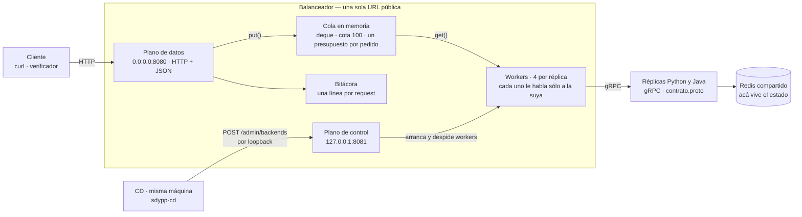
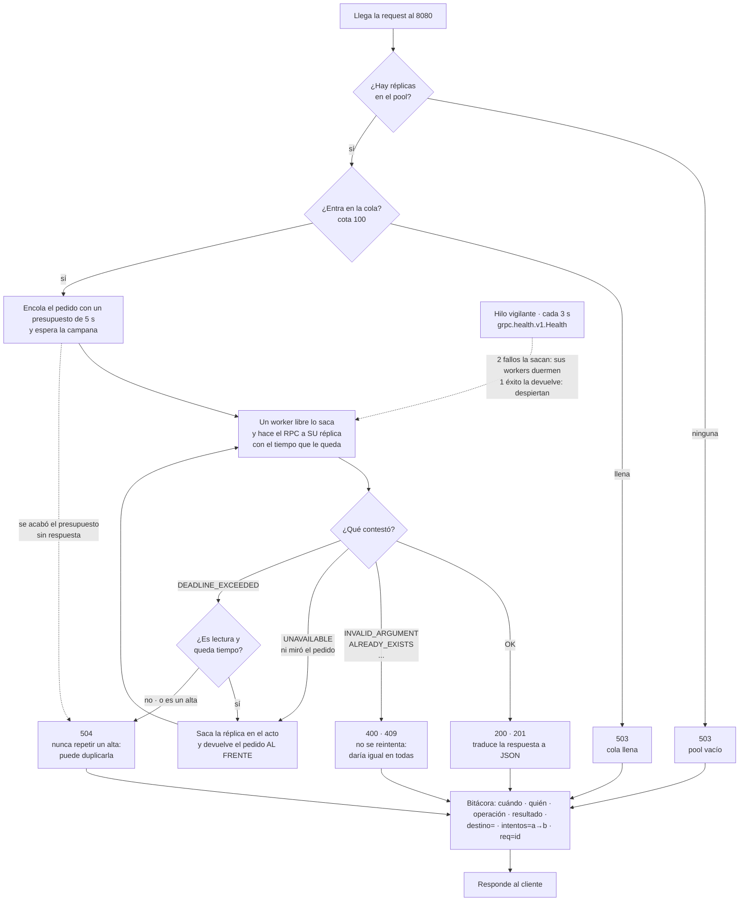

# Balanceador — SDyPP Clase 2

La única URL pública del servicio. **Habla HTTP hacia afuera y gRPC hacia adentro:**
recibe el contrato del enunciado (`GET /`, `GET /health`, `POST /echo`,
`GET /personas`, `POST /personas`), encola cada pedido, y un hilo *worker* por réplica
lo saca y le hace el RPC de `contrato.proto` que corresponda.

No elige réplica: **la réplica que tiene un worker libre saca el pedido.** Si no lo pudo
atender, lo devuelve al frente de la cola y lo saca otra. Un pedido nunca pertenece a
un servidor.

Traduce en vez de reenviar bytes porque el enunciado pide **una línea de bitácora
por request diciendo a quién se la derivó**, y para escribir esa línea hay que
entender el pedido. Un proxy TCP no sabría qué operación pasó.

### El mapa



Las réplicas no están hardcodeadas: el CD las conmuta por el plano de control cuando
despliega una versión. El plano de datos nunca conoce `/admin`, y el de control nunca
ve tráfico del servicio.

### Qué hace con cada request



La reasignación y el `req=` de la bitácora son los dos agregados propios: el enunciado
pide elegir, reenviar y responder, y esto además tapa la muerte de una réplica y deja
la operación auditable — el mismo `req=` aparece en la casa que murió (sin respuesta)
y en la que atendió.

## Levantarlo

```bash
python3 consola.py
```

La primera vez pregunta lo que hace falta, guarda **`balanceador.env`** —que es el
`--env-file` del contenedor— y lo levanta. Después es el menú:

```
  Balanceador · casa-tomas · público :8080 · control 127.0.0.1:8081
  3/3 sanas · 0/100 en cola

  1  Pool                     qué réplicas hay, sanas, en vuelo y atendidas
  2  Health público           lo que ve el verificador
  3  Tráfico de prueba        correr el verificador contra este balanceador
  4  Agregar / quitar backend  a mano, para una emergencia
  5  Bitácora                 últimas 25 líneas
  6  Contenedor               levantar, reiniciar, bajar, logs
  7  Configuración            ver y editar
  8  Consola del CD           el otro componente de Plataforma
  0  Salir
```

**El pool arranca vacío a propósito.** `BA_BACKENDS` queda sin usar: lo llena el CD en el
primer deploy. Precargarlo haría que el balanceador afirme tener réplicas que quizá ya no
existen. Hasta ese primer deploy, `/health` contesta `503`, que es correcto: no hay a quién
mandarle nada.

La pregunta que importa del asistente es **quién puede tocar `/admin/backends`**: quien lo
alcance decide a dónde va todo el tráfico. El default es `127.0.0.1`, porque el CD corre en
esta misma máquina; la otra opción (un CD remoto, Etapa 3) obliga a declarar una lista blanca.

La opción 8 abre la consola del CD, que vive en el repo `cd` al lado: **Plataforma corre los dos
componentes**, y el orden importa — primero el balanceador, después el CD.

### A mano, si preferís

```bash
docker build -t sdypp-balanceador:local .
docker run -d --name sdypp-ba --restart unless-stopped --network host \
    --env-file balanceador.env \
    -v "$PWD/logs:/app/logs" \
    sdypp-balanceador:local

curl -s localhost:8080/health | python3 -m json.tool
```

`--network host` es para que el CD, que corre en esta misma máquina también con
`--network host`, llegue al plano de control por `127.0.0.1:8081`. Nada más lo alcanza.

Sin Docker: `python3 -m venv .venv`, `./.venv/bin/pip install -r requirements.txt
-r requirements-build.txt`, generar los stubs con `./.venv/bin/python -m
grpc_tools.protoc -I. --python_out=app --grpc_python_out=app contrato.proto` y
`./.venv/bin/python app/balanceador.py`.

## Pruebas

```bash
./.venv/bin/python -m unittest discover -s tests -v
```

Sólo `unittest`. `test_cola.py` y `test_worker.py` no necesitan nada más que `grpcio`;
`test_derivar.py` importa el balanceador y necesita los stubs generados. Ninguno abre
una conexión: las réplicas se simulan con un stub falso que decide qué contestar.

- **`Cola`**: la cota rechaza sin bloquear, el orden es FIFO, lo devuelto al frente sale
  primero, `get` bloquea de verdad y sale sin sacar nada cuando su réplica deja de estar
  viva, y 8 hilos sacando 200 pedidos no repiten ni pierden ninguno.
- **`Worker`**: cada fila de la tabla de reintento, la metadata, el pedido vencido en la
  cola (no gasta el RPC), y la reasignación completa entre una réplica caída y una viva.
- **`derivar`**: 503 inmediato sin réplicas o con la cola llena, 504 al vencer el
  presupuesto, traducción de códigos, e `intentos=a→b` en la bitácora.

Contra réplicas de verdad, con el verificador en `--hilos 32` y `docker stop` de una
réplica a mitad de la corrida: 4000/4000 OK y una línea con `intentos=` en la bitácora.

## Verificador

Lo corre **otro equipo, desde otra casa**. Sólo biblioteca estándar: no hace falta
instalar nada nuestro para probarnos.

```bash
python3 app/verificador.py http://100.101.15.93:8080 --n 100 --hilos 8 --alta
```

Informa códigos, reparto por instancia, latencia p50/p95/p99 y throughput, y con
`--alta` da de alta una persona y la lee en la request siguiente.

## Los dos planos

| | Puerto | Escucha en | Qué sirve |
| :--- | :--- | :--- | :--- |
| **Datos** | `8080` | `0.0.0.0` | El contrato público. En `/admin` devuelve **404** |
| **Control** | `8081` | `127.0.0.1` | Sólo `/admin/backends` |

`/admin/backends` decide a dónde va **todo** el tráfico: quien lo toca manda el
servicio a donde quiera. Por eso no vive en el puerto público sino en un socket
propio que escucha únicamente en loopback: **lo que no escucha en la red no se puede
atacar desde la red.**

El único que conmuta es el CD, y corre en esta misma máquina. En la primera versión
cada casa desplegaba la suya y avisaba desde su máquina, y el plano de control tenía
que salir al tailnet con una lista blanca de cuatro IPs. Con el CD central la
superficie vuelve a cero direcciones. `BA_ADMIN_BIND` y `BA_ADMIN_IPS` quedan para la
Etapa 3: un segundo balanceador en otra casa las usa para dejar entrar **sólo** a la IP
de la Plataforma.

La conmutación es HTTP y no un RPC nuevo, así que **`contrato.proto` no se toca** —
el que ya tiene el equipo Java sigue siendo válido.

```
POST /admin/backends   {"agregar": [{"destino": "casa:8091", "app": "python"}],
                        "quitar":  [{"destino": "casa:8090", "app": "python"}]}
```

Primero agrega y después quita: al revés hay un instante con menos réplicas en
rotación. Quitar no corta nada: los workers de esa réplica terminan lo que tienen en
vuelo y recién ahí se cierra el canal.

**Es un delta, no un reemplazo.** El pool es un diccionario y el POST suma y resta:
un destino que no aparece en el JSON queda exactamente donde estaba, con su mismo
objeto `Backend`, sus workers y sus contadores. De eso depende que un deploy de Python
no toque las réplicas Java, y al revés — los dos equipos despliegan sin coordinarse.

Se aceptan las dos formas, `"host:puerto"` y `{"destino": ..., "app": ...}`. La corta
asume `python` por compatibilidad con el CD viejo, que mandaba strings pelados; el CD
manda **la larga**, porque con la corta una réplica Java entraría al pool etiquetada
como Python y `/health` mentiría. El campo `app` es informativo: no interviene en el
ruteo, todas las réplicas comen de la misma cola. `tests/test_admin.py` cubre las dos
formas y el caso de los dos equipos conviviendo en el pool.

## Por qué la cola vive adentro

La cola y los workers son hilos del mismo proceso, no un contenedor aparte. Se pensó
como servicio separado y se descartó por tres razones:

1. **No tiene ciclo de vida propio.** Se levanta con el balanceador, se baja con él,
   se configura con él. Un contenedor que no puede existir sin otro no es un servicio,
   es una parte.
2. **Agregaría un salto y un punto de falla** por request, para ganar nada: el
   balanceador ya es el único proceso que ve todos los pedidos.
3. **La Etapa 3 la haría inútil.** Dos balanceadores compartiendo una cola vuelven a
   tener un punto único de falla, justo el que la Etapa 3 quiere eliminar. Y como el
   contrato es sincrónico (el cliente espera la respuesta en el mismo socket), un
   pedido que un balanceador tomó y otro atendió no tiene por dónde volver. Por eso la
   Etapa 3 son dos balanceadores **independientes**, cada uno con su cola, sin
   hablarse. Nada de `cola.py` cambia.

## Reglas

**Un presupuesto por pedido, espera incluida.** `BA_TIMEOUT_RPC=5` son cinco segundos
desde que el pedido entra a la cola hasta que el cliente tiene respuesta. Un pedido que
esperó 4 s tiene 1 s de RPC. Lo que le importa al cliente es cuánto tarda la respuesta,
no en qué parte del camino se fue el tiempo.

**Cota de 100.** Pasado eso, `503` en el acto. Sin cota, con todas las réplicas caídas
los pedidos se acumulan sin límite hasta vencer; cada uno es un hilo del servidor y un
cliente colgado.

**La regla de reintento.** Es contrato, no detalle de implementación:

| Código gRPC | Lecturas (`Identidad`, `Echo`, `ListarPersonas`) | Escritura (`CrearPersona`) |
| :--- | :--- | :--- |
| `UNAVAILABLE` | devolver al frente + sacar la réplica | igual |
| `DEADLINE_EXCEEDED` | devolver al frente si queda tiempo; si no, `504` | **`504`. Nunca reintentar.** |
| `INVALID_ARGUMENT`, `ALREADY_EXISTS`, otros | ese código | ese código |

`UNAVAILABLE` significa que la réplica ni miró el pedido: reintentar es gratis.
`DEADLINE_EXCEEDED` en un alta significa "no sé si se ejecutó": repetirla puede crear
la persona dos veces. Preferimos un `504` honesto a un duplicado silencioso.

**No se persiste.** La cola vive en memoria: si el balanceador muere, los pedidos que
tenía adentro mueren con él — y también el socket HTTP por el que el cliente esperaba,
así que persistirlos no le devolvería nada a nadie.

## Decisiones

**Consumidores que compiten, sin round-robin.** Nadie reparte: cada réplica tiene 4
workers que sacan de la cola cuando pueden. Una réplica lenta saca menos; una caída no
saca nada. El reparto sale solo de la velocidad de cada una, sin contador compartido.
Medido con 32 hilos: 206 / 200.

**Salud preguntando, y también reaccionando.** Un hilo consulta
`grpc.health.v1.Health` cada 3 s. Si sólo esperáramos a que una request falle, cada
muerte le costaría un error a un usuario real; si sólo preguntáramos, entre dos
chequeos hay una ventana. Se hacen las dos, y **alimentan el mismo contador**: un
`UNAVAILABLE` en un worker cuenta como un chequeo fallido.

**Dos fallos para sacar, uno para volver.** Un timeout aislado es normal en una red
doméstica. Sacar una réplica sana por un hipo de red cuesta más que atender una
request de más contra una que ya murió.

**Un canal gRPC por réplica, reusado.** gRPC multiplexa varias llamadas sobre la
misma conexión HTTP/2; abrir un canal por request tiraría el handshake a la basura.
El canal lo cierra el último worker en irse: mientras quede otro puede tener un RPC
en vuelo sobre esa misma conexión.

## Traducción de errores

| gRPC | HTTP |
| :--- | :--- |
| `OK` | `200` · `201` en alta |
| `INVALID_ARGUMENT` | `400` |
| `ALREADY_EXISTS` | `409` |
| `UNAVAILABLE` en todas | `504` al vencer el presupuesto |
| `DEADLINE_EXCEEDED` | `504` |
| — | `503` sin réplicas en el pool · `503` cola llena |

## Bitácora

Mismo formato que el de las réplicas, a propósito: es lo que permite tomar un alta
del verificador y seguirla por dos archivos en dos casas.

```
2026-09-17T02:15:33-03:00 | balanceador@casa-tomas | POST /personas | 201 | destino=100.91.134.43:8080 id=7 req=4b7baf0d2d4a4e909ec90c6f17690125
2026-09-17T02:15:33-03:00 | balanceador@casa-tomas | GET / | 200 | destino=100.101.15.93:8080 host=tomas-blue intentos=100.101.15.93:8090→100.101.15.93:8080 req=216fdab3aed647099557e2dcd8c220f5
```

El balanceador dice **a quién derivó**; el log de esa casa dice **qué hizo**. El
`req=` viaja a la réplica como metadata `x-request-id` (la misma en cada intento), e
`intentos=a→b` aparece sólo cuando hubo reasignación: es la evidencia de que la
réplica `a` murió y `b` atendió el mismo pedido.

## Variables

| | Default | |
| :--- | :--- | :--- |
| `BA_PUERTO` | `8080` | Puerto público |
| `BA_PUERTO_ADMIN` | `8081` | Plano de control |
| `BA_ADMIN_BIND` | `127.0.0.1` | Dónde escucha el control. Sólo se cambia en la Etapa 3 |
| `BA_ADMIN_IPS` | *(vacío)* | Whitelist; vacío = sólo loopback |
| `BA_CASA` | `casa-tomas` | Sale en la bitácora |
| `BA_BACKENDS` | *(vacío)* | Réplicas iniciales, separadas por coma. `host:puerto` o `host:puerto=java` |
| `BA_COTA_COLA` | `100` | Pedidos que pueden esperar; llena → `503` |
| `BA_WORKERS_POR_REPLICA` | `4` | Hilos por réplica = pedidos en vuelo por réplica |
| `BA_TIMEOUT_RPC` | `5` | Presupuesto total por pedido, espera en cola incluida |
| `BA_INTERVALO_SALUD` | `3` | Segundos entre chequeos |
| `BA_FALLOS_PARA_SACAR` | `2` | Fallos seguidos que sacan de rotación (chequeo o request) |
| `BA_EXITOS_PARA_VOLVER` | `1` | Chequeos buenos seguidos que la devuelven |
| `BA_TIMEOUT_SALUD` | `2` | Segundos por chequeo de salud |

## Estado

| | |
| :--- | :--- |
| ✅ | Cola en memoria + workers por réplica, sin round-robin |
| ✅ | Reasignación al frente de la cola; un alta nunca se repite |
| ✅ | Health check continuo + expulsión + reingreso, con el mismo contador que los workers |
| ✅ | Conmutación por HTTP sin tocar el `.proto`, sólo desde el CD por loopback |
| ✅ | Bitácora cruzable con la de las réplicas: `req=` e `intentos=` |
| ✅ | Tests: cola, worker, derivar |
| ✅ | Verificador con reparto y percentiles |
| ✅ | Réplicas Java en el pool: mismo `contrato.proto`, mismo health check |
| ⬜ | Etapa 3: dos balanceadores independientes |
